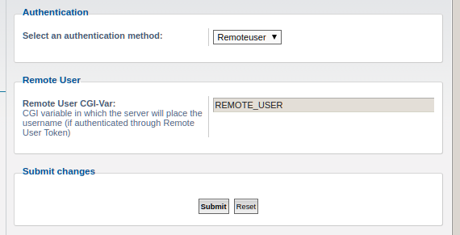

# Remote User Authentication


The Remote User Authentication plugin for phpbb will authenticate users
based on a username provided in a CGI variable. It is expected that this CGI
variable is set by the server technology that is serving the forum.

This allows for very straightforward integration with various Single Sign-On
services.

## Installation

1. Copy the extension to `phpBB/ext/cheshirekow/remoteuserauth`
2. Go to `ACP` > `Customise` > `Extensions` and enable the
   "Remote User Authentication" extension.
3. Go to `ACP` > `Authentication`
4. In the dropdown, select `Remoteuser` and enter the name of the CGI variable
   to check for the authenticated user's `username`.



## How it works

Your authentication service somehow provides to your webserver and indicator
that the user is authenticated, along with that user's username. The webserver
then forwards that username through a configurable CGI variable (default is
`REMOTE_USER`).

The authentication plugin will look for this CGI variable. If it is set then
the plugin will autologin the user with that username (creating the user if
necessary).


## Example setup

On our example server we are executing a number of server applications:

* `nginx` - a reverse proxy
* `php-fpm` - fastcgi process manager for phpbb (and maybe other php scripts)
* `auth-service` - explained further below
* additional services...


`nginx` is built with the `auth_request` module and we have configured it to
forward authentication requests to the `auth-service` listening on port `808`.
The relevent nginx config might look something like this:

```
location /auth {
  auth_request off;
  proxy_pass http://localhost:8081;
  proxy_pass_request_body on;
  proxy_set_header X-Original-URI $request_uri;
}

location = /auth/query_auth {
  proxy_pass http://localhost:8081;
  proxy_pass_request_body off;
  proxy_set_header Content-Length "";
  proxy_set_header X-Original-URI $request_uri;
}

location / {
  auth_request /auth/query_auth;
  try_files $uri $uri/ =404;
}

location ~ \.php(/|$) {
  auth_request /auth/query_auth;
  auth_request_set $user $upstream_http_x_myauth_user;

  include snippets/fastcgi-php.conf
  fastcgi_param REMOTE_USER $user;
  fastcgi_pass unix:/run/php/php7.0-fpm.sock;
}
```

In addition:

* phpbb is installed under `phpbb/` in the webroot.
* the auth service includes a response header `X-MyAuth-User` which contains
  the user's name if they are correctly authenticated.

An example of such an authentication service which authenticates using google
or github is `oauthsub` ([github][1], [pypi][2])

[1]: https://github.com/cheshirekow/oauthsub
[2]: https://pypi.org/project/oauthsub/

## Functional Tests

Functional tests must be run in the presence of an active webserver correctly
configured to forward the `X-Remote-User` request header as the `REMOTE_USER`
CGI variable. You can refer to the travis configurations and scripts or
utilize the following example setup, which is useable as-is for an ubuntu
16.04 (xenial) system:

0. Install dependencies:

    * php-sqlite3
    * php-xml
    * php-imagick
    * php-gd
    * php-fpm

1. Clone phpbb branch `3.2.x` into `/tmp/phpBB3`
2. Clone this extension into `/tmp/phpBB3/phpBB/ext/cheshirekow/remoteuser`
3. Start nginx using the configuration `doc/nginx-fg.conf`

        nginx -p /tmp \
        -c /tmp/phpBB3/phpBB/ext/cheshirekow/remoteuser/doc/nginx-fg.conf \
        -g "error_log /tmp/nginx-error.log;"

4. Start php-fpm using the configuraiton `doc/php-fpm.conf`

        php-fpm --nodaemonize \
        --fpm-config /tmp/phpBB3/phpBB/ext/cheshirekow/remoteuser/doc/php-fpm.conf

5. Write the following to `phpBB3/tests/test_config.php`:

        <?php
        $phpbb_functional_url = 'http://localhost:8080/';
        $dbms = 'phpbb\\db\\driver\\sqlite3';
        $dbhost = '/tmp/phpbb-test.sqlite';
        $dbport = '';
        $dbname = '';
        $dbuser = '';
        $dbpasswd = '';
        $table_prefix = 'phpbb_';

6. Setup dependencies

        :/tmp/webroot/phpBB3/phpbb$ php ../composer.phar install --dev --no-interaction

7. Start unit tests with:

    ```
    :/tmp/webroot/phpBB3$ ./phpBB/vendor/bin/phpunit \
       --configuration phpBB/ext/cheshirekow/remoteuserauth/phpunit.xml \
       --bootstrap ./tests/bootstrap.php
    ```


## License

[GPLv2](license.txt)
